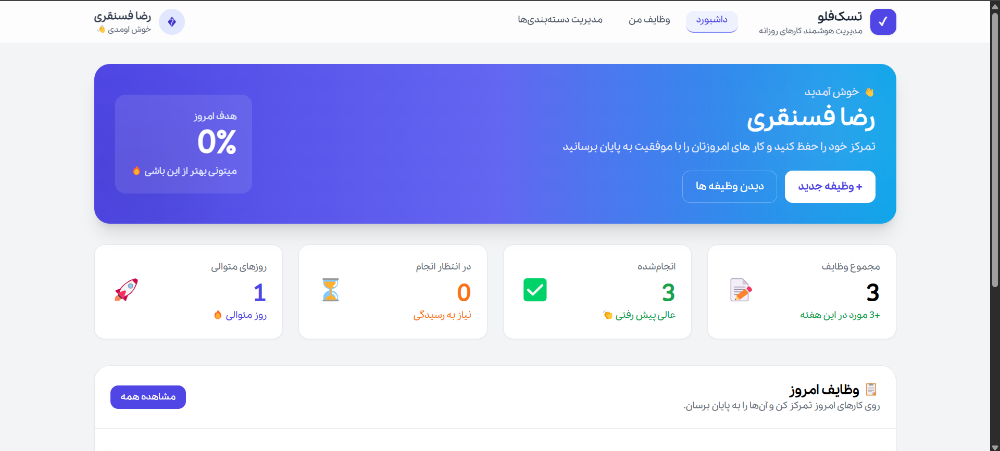
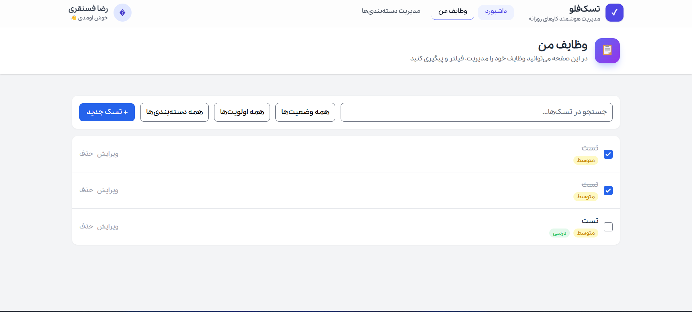
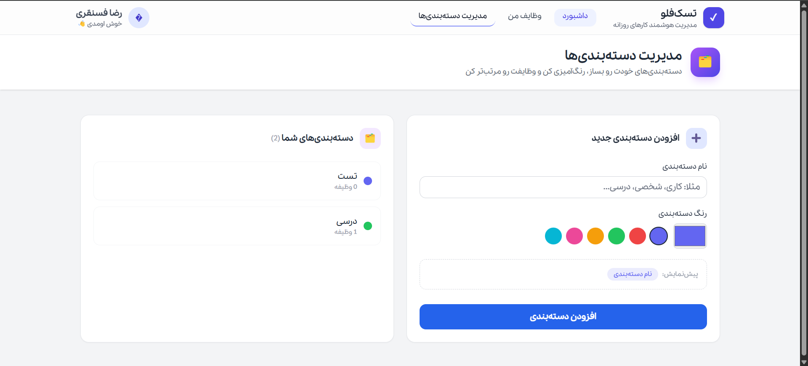
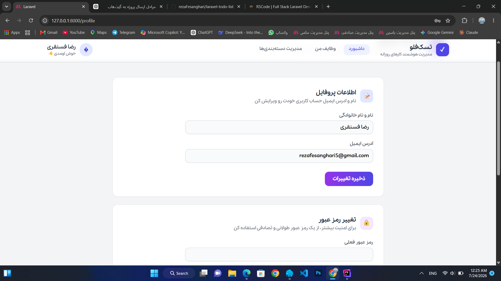

<div align="center">

# 🚀 TaskFlow

### A Modern Task Management System Built with Laravel

A clean, modern and responsive task management application developed with **Laravel**, **Livewire** and **Tailwind CSS**.

Designed as a portfolio project to demonstrate clean architecture, authentication, CRUD operations and modern UI development.

<br>

<!-- Badges -->


</div>

---

# 📖 About

TaskFlow is a modern task management application built to help users organize their daily workflow in a simple and efficient way.

The project focuses on providing a clean user experience while demonstrating best practices in Laravel development.

This repository was created as a portfolio project.

---

# ✨ Features

## 🔐 Authentication

- Login
- Register
- Forgot Password
- Email Verification
- Password Confirmation

---

## ✅ Task Management

- Create Task
- Update Task
- Delete Task
- Task Categories
- Due Date
- Task Status
- Task Priority
- Search Tasks
- Filter Tasks

---

## 📂 Category Management

- Create Category
- Edit Category
- Delete Category

---

## 👤 Profile Management

- Update Profile
- Change Password
- Delete Account

---

## 📊 Dashboard

- Tasks Overview
- Statistics
- Progress Summary
- Quick Actions

---

## ⚡ Livewire Components

Most interactive parts of the application are powered by Livewire for a fast and smooth user experience.

---

# 📸 Screenshots

| Dashboard | Tasks |
|-----------|-------|
|  |  |

| Categories | Profile |
|-----------|---------|
|  |  |

| Login | Register |
|-------|----------|
|  |  |

# 🌐 Live Demo

> Coming Soon...

```
[https://your-domain.com](https://todo.rscode.ir/)
```

---

# 🛠️ Tech Stack

| Technology | Description |
|------------|-------------|
| Laravel 10 | Backend Framework |
| Livewire | Dynamic Components |
| Blade | Templating Engine |
| Tailwind CSS | UI Framework |
| MySQL | Database |
| Vite | Asset Bundler |

---

# 📁 Project Structure

```
app
bootstrap
config
database
public
resources
routes
storage
tests
```

---

# 🚀 Installation

Clone the project

```bash
git clone https://github.com/rezaFesanghari/taskflow.git
```

Go to project

```bash
cd taskflow
```

Install dependencies

```bash
composer install
npm install
```

Copy environment

```bash
cp .env.example .env
```

Generate key

```bash
php artisan key:generate
```

Configure database inside **.env**

Run migrations

```bash
php artisan migrate
```

Run development server

```bash
php artisan serve
npm run dev
```

---

# 📌 Roadmap

- [x] Authentication
- [x] Dashboard
- [x] Profile Management
- [x] Categories
- [x] Task Management
- [ ] Notifications
- [ ] Calendar View
- [ ] Drag & Drop Tasks
- [ ] Dark Mode

---

# 🎯 Project Goals

This project was developed to demonstrate:

- Laravel Fundamentals
- Livewire Development
- Authentication
- CRUD Operations
- Database Design
- Responsive UI
- Clean Code Principles

---

# 📈 Future Improvements

- Notifications
- Calendar
- Drag & Drop
- Task Attachments
- Team Collaboration
- API Version

---

# 🤝 Contributing

Contributions are welcome.

Feel free to fork the repository and submit a pull request.

---

# 📄 License

This project is licensed under the MIT License.

---

# 👨‍💻 Developer

**Reza Fesanghari**

Backend Developer (Laravel)

GitHub

https://github.com/rezaFesanghari

Email

rezafesanghari2580@gmail.com

Portfolio

Coming Soon...

LinkedIn

Coming Soon...
